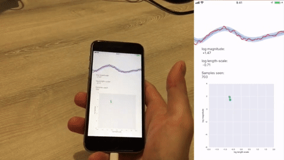

# Infinite-Horizon Gaussian Processes

[Arno Solin](http://arno.solin.fi) · James Hensman · Richard E. Turner

Codes for the paper:

* Arno Solin, James Hensman, and Richard E. Turner (2018). **Infinite-horizon Gaussian processes**. *Advances in Neural Information Processing Systems (NIPS)*. Montréal, Canada. [[preprint on arXiv](https://arxiv.org/abs/1811.06588)]

## Summary

Gaussian processes provide a flexible framework for forecasting, removing noise, and interpreting long temporal datasets. State space modelling (Kalman filtering) enables these non-parametric models to be deployed on long datasets by reducing the complexity to linear in the number of data points. The complexity is still cubic in the state dimension m which is an impediment to practical application. In certain special cases (Gaussian likelihood, regular spacing) the GP posterior will reach a steady posterior state when the data are very long. We leverage this and formulate an inference scheme for GPs with general likelihoods, where inference is based on single-sweep EP (assumed density filtering). The infinite-horizon model tackles the cubic cost in the state dimensionality and reduces the cost in the state dimension m to O(m^2) per data point. The model is extended to online-learning of hyperparameters. We show examples for large finite-length modelling problems, and present how the method runs in real-time on a smartphone on a continuous data stream updated at 100 Hz.

## 3-minute video abstract

[Link to video on YouTube](http://www.youtube.com/watch?v=myCvUT3XGPc)

## Matlab implementation

We provide Matlab implementations for infinite-horizon GP regression (`ihgpr.m`) and single-sweep EP / assumed density filtering (`ihgp_adf.m`). Additionally, for comparison we provide a streamlined implementation of State Space Gaussian Processes with Non-Gaussian Likelihood (ICML 2018). Details on the Matlab implementation are in the README under `matlab/`.

Examples:
* Regression example (Gaussian)
* Coal mining example (LGCP/Poisson)
* Classification example (probit and logit)

**Example:** *The GP classification example from the paper supplement as a streaming version. Here, a probit model is used in combination with a Matérn (3/2) GP prior and single-sweep EP (ADF). The hyperparameters are fixed. The dashed lines show the exact solution from the state space GP (also using single-sweep EP).*

## C++ codes

Additionally we provide a simplified C++ implementation of the GP regression codes. This is mostly to underline the speed-up gained by C++ and additionally make the iOS demo possible (see below). Details on the C++ implementation are in the README under `cpp/`.

## Objective-C codes (iOS example app)

Finally, we share the proof-of-concept iOS app source code that implements the demo in the final example in the paper. This implementation is only for reference and likely to break as Apple updates XCode. Details on the app implementation are in the README under `ios/`.

**Example:** *IHGP running on an iPhone 6S with data supplied by the internal accelerometer at 100 Hz. The online adaptation of the hyperparameters of the Matérn (3/2) covariance function in the GP prior are shown on log-scale in the bottom figure.*

## License

This software is distributed under the GNU General Public License (version 3 or later); please refer to the file `LICENSE`, included with the software, for details.
