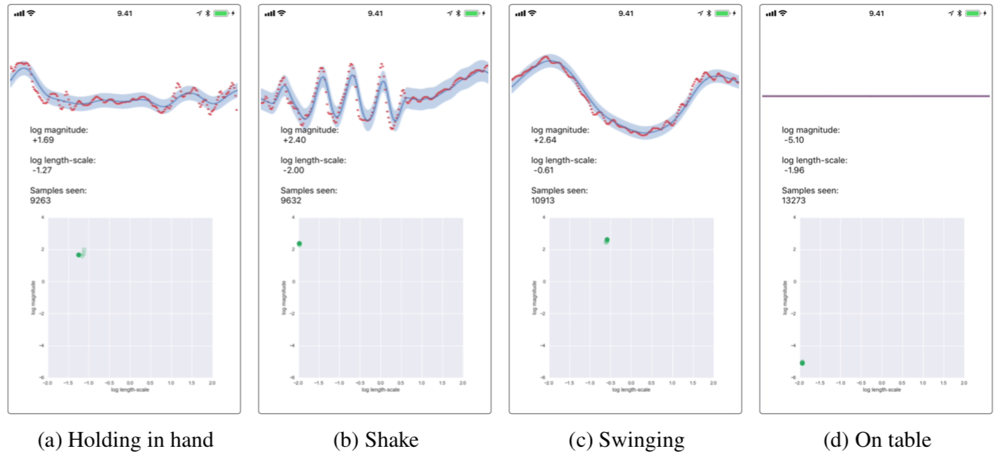

## Infinite-horizon GPs: iOS example app

We share the proor-of-concept iOS app source code that implements the demo in the final example in the paper **Infinite Horizon Gaussian Processes** paper.

We use the IHGP in C++ with wrappers in Objective-C for running as an app on an Apple iPhone 6s. We use the phone accelerometer x channel (sampled at 100 Hz) as an input and fit a GP to a window of 2 s with Gaussian likelihood and a Matérn (ν = 3/2) prior covariance function. We fix the measurement noise to σ^2 = 1 and use separate learning rates η = (0.1, 0.01) in online estimation of the magnitude scale and length-scale hyperparemeters. 

The lower plot shows current hyperparameters  of the prior covariance function, with a trail of previous hyperparameters. The top part shows the last 2 seconds of accelerometer data (red), the GP mean, and 95% quantiles. The refresh rate for updating the hyperparameters and re-prediction is 10 Hz.

Screenshots of various modes motion.

## Dependencies

The code uses the [C++ code](../cpp/) in this repo and you need to make sure you have the required libraries installed before attempting to compile the app (primarily you need Eigen). Further, the app must be run on an actual device (running in the simulator does not give you any accelerometer inputs to try on). Therefore you must have a valid Apple Developer ID (and a device to test on).

**NB:** This implementation is only for reference and likely to break as Apple updates XCode. The app has been tested on XCode 9 and a iPhone 6S running iOS 11. As usual, the app is likely to break with future updates of XCode and iOS, and it will not be supported/updated. This example is provided *as is*, with the hope that it will be insightful, but without any guarantees that it will work on future versions of the devices or even compile on future versions of the developer tools.

## How to run it

With the previous warnings said, this is how it should run. Open the Xcode project, change the bundle identifier and developer credentials, and compile. Enjoy shaking your device and watching the hypnotic GP fit smoothly adapt to your motion.
